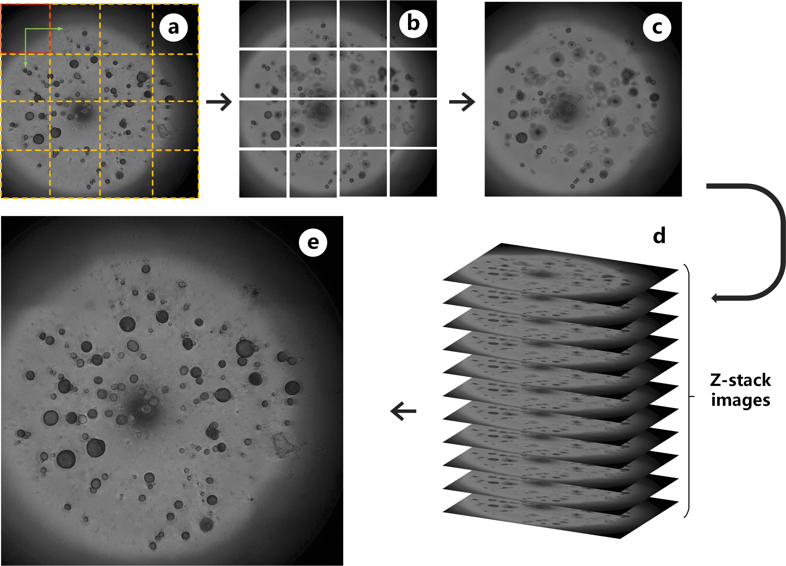
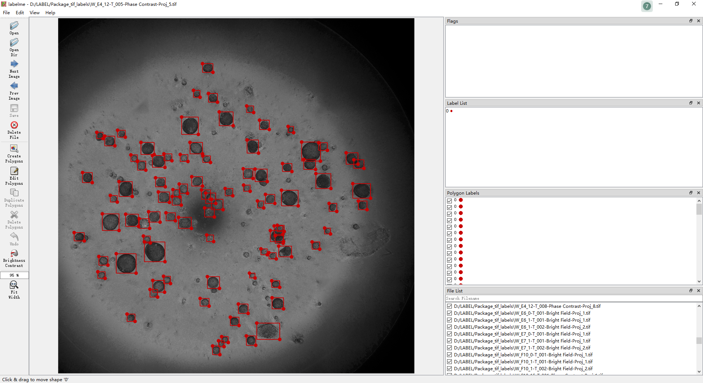
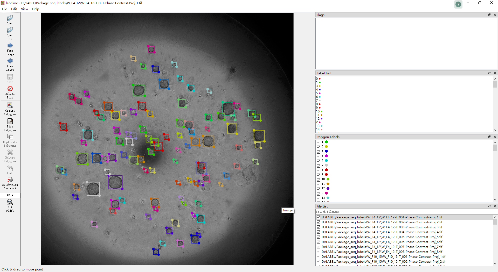
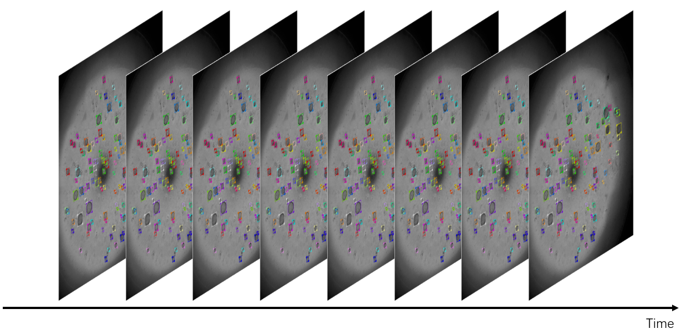

# High-throughput Organoid Tracking Dataset

## 1. Image Capture

Pipeline for capturing high-throughout organoid images. The dash frame in (**a**) are FOVs for scanning. Image patches in (**b**) are montages captured from 16 FOVs. (**c**) shows the stitched images from specific focus plane. 32 z-stack images in (**d**) are projected to generate (**e**).

## 2. File organization
``` bash
ORGANOID DATA
├─Detection
└─Tracking 
    ├─W_E4_12 # well name
    │      Proj_1.json # annotations
    │      Proj_1.tif  # raw high-throughput organoid image
    │      Proj_2.json
    │      Proj_2.tif
    │      Proj_3.json
    │      Proj_3.tif
    │      ......
    │
    ├─W_F10_15
    ├─W_F10_3
    ├─ ......
```
## 3. Annotation parsing
All annotation are created by [labelme](https://github.com/wkentaro/labelme)  software (version 4.5.7). The json file for each image can be parsed by labelme directly and get the detailed information. In addition, we can also use the **json** package to read the annotation information.
- Detection labels


- Tracking labels
  
  

The json file contains two kinds of key information: First,the position of each qualified organoid; Second, the identity of each qualified organoid.
```json
{
  "version": "4.5.6",
  "flags": {},
  "shapes": [
    {
      "label": "0",
      "line_color": null,
      "fill_color": null,
      "points": [
        [
          746.0,
          402.0
        ],
        [
          801.0,
          455.0
        ]
      ],
      "shape_type": "rectangle",
      "flags": {}
    }
    // other shape
  ],
  "imagePath": "XXXXXXXXXX.tif",
  "imageData": "......",
  "imageHeight": 9122,
  "imageWidth": 9163
}
```


## 4. Download
Coming soon.

## 5. Acknowledgement
The data are captured by Accurate International Biotechnology (GZ) Co., Ltd, Nanfang Hospital and Southern Medical University. All annotation are created by team of Fujian Key Laboratory of Sensing and Computing for Smart City, Xiamen University. The data is available for free to researchers for non-commercial use.
